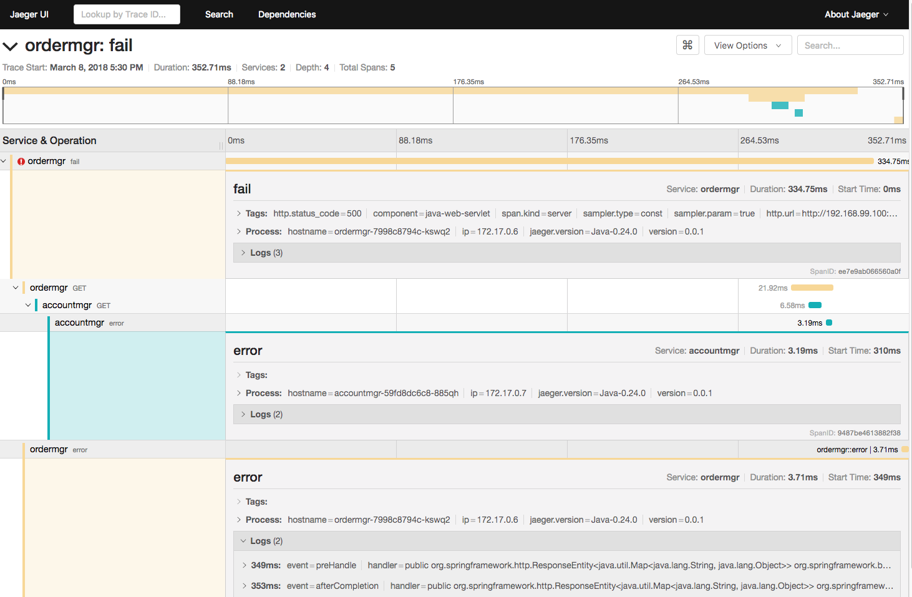

F5 CNCF Labs
==================

This introductory lab covers the following topics:


Lab 1: Install a Kubernetes Cluster (1 Master and 2 nodes)
===================================================
The purpose of this lab is help you install a Kubernetes Cluster (1 Master and 2 nodes)
- [Cluster installation](./docs/cluster-setup-guide/cluster-setup-guide-cluster-installation.rst)
- [Setup master] (./docs/cluster-setup-guide/cluster-setup-guide-master-setup.rst)
- [Node setup](./docs/cluster-setup-guide/cluster-setup-guide-node-setup.rst)
- [Test our setup](./docs/cluster-setup-guide/cluster-setup-guide-cluster-test.rst)

The lab guide is hosted here: http://f5-101-lab-kubernetes.readthedocs.io

Lab 2: How to install and use F5 Container connector
====================================================
This lab covers the following topics:

- Install the F5 Kubernetes BIG-IP Controller
    - BIG-IP setup
    - Container Connector deployment
- Deploy an application and leverage our CC
    - Define a deployment
    - Define a ConfigMap
    - Define a Service

Lab 3.0: Setting up Heapster with influxdb and Grafana
======================================================

Git Clone https://github.com/kubernetes/heapster

Modify grafana.yaml
```
    # kubernetes.io/cluster-service: 'true'

```
    type: NodePort

Modify heapster.yaml
```
    #kubernetes.io/cluster-service: 'true'

Modify influxdb.yaml
```
    #kubernetes.io/cluster-service: 'true'

zji@~> kubectl create -f heapster/deploy/kube-config/influxdb/
deployment "monitoring-grafana" created
service "monitoring-grafana" created
serviceaccount "heapster" created
deployment "heapster" created
service "heapster" created
deployment "monitoring-influxdb" created
service "monitoring-influxdb” created

zji@~> kubectl create -f kubernetes-course/deployment/helloworld.yml
deployment "helloworld-deployment” created


Lab 3: Kubernetes cluster monitoring with Prometheus and Grafana
====================================================
If you are using minikube, please follow the following document:
docs/prometheus/prometheus-grafana-installation.rst

For my case, I use kubeadm to build my own Kubernetes Cluster (1 Master and 2 nodes). I encountered some issue with above steps.
Instead, I leveraged kube-prometheus to use a single command for installation.

```
    git clone https://github.com/coreos/prometheus-operator.git
```
Simply run:

```
export KUBECONFIG=<path> # defaults to "~/.kube/config"
cd contrib/kube-prometheus/
hack/cluster-monitoring/deploy
```
After all pods are ready, you can reach:

Prometheus UI on node port 30900
- Alertmanager UI on node port 30903
- Grafana on node port 30902
- To tear it all down again, run:

```
hack/cluster-monitoring/teardown
```
Lab 4: gRPC
====================================================
This guide gets you started with gRPC in Go with a simple working example.
For installation details, follow this ![Quick Starts] (https://grpc.io/docs/quickstart/go.html)

## Prerequisites 
### Go version
gRPC requires Go 1.6 or higher.
```
$ go version
```

### Install gRPC
Use the following command to install gRPC.
```
$ go get -u google.golang.org/grpc
```

### Install Protocol Buffers v3
Install the protoc compiler that is used to generate gRPC service code. The simplest way to do this is to download pre-compiled binaries for your platform(protoc-<version>-<platform>.zip) from here: https://github.com/google/protobuf/releases

- Unzip this file.
- Update the environment variable PATH to include the path to the protoc binary file

### Install the protoc plugin for Go
```
$ go get -u github.com/golang/protobuf/protoc-gen-go
```
The compiler plugin, protoc-gen-go, will be installed in $GOBIN, defaulting to $GOPATH/bin. It must be in your $PATH for the protocol compiler, protoc, to find it.
```
$ export PATH=$PATH:$GOPATH/bin
```
## Example-1: helloworld 
### Download the example
The grpc code that was fetched with go get google.golang.org/grpc also contains the examples. They can be found under the examples dir: $GOPATH/src/google.golang.org/grpc/examples.

### Try it
To compile and run the server and client code, the go run command can be used. In the examples directory:
```
$ go run greeter_server/main.go
```
From a different terminal:
```
$ go run greeter_client/main.go
```
If things go smoothly, you will see the Greeting: Hello world in the client side output.

### Update a gRPC service
Let’s update this so that the Greeter service has two methods.
Edit helloworld/helloworld.proto and update it with a new SayHelloAgain method, with the same request and response types:
```
// The greeting service definition.
service Greeter {
  // Sends a greeting
  rpc SayHello (HelloRequest) returns (HelloReply) {}
  // Sends another greeting
  rpc SayHelloAgain (HelloRequest) returns (HelloReply) {}
}

// The request message containing the user's name.
message HelloRequest {
  string name = 1;
}

// The response message containing the greetings
message HelloReply {
  string message = 1;
}
```
### Generate gRPC code
```
$ protoc -I helloworld/ helloworld/helloworld.proto --go_out=plugins=grpc:helloworld
```
This regenerates the helloworld.pb.go with our new changes.

### Update and run the application
Update the server
Edit greeter_server/main.go and add the following function to it:
```
func (s *server) SayHelloAgain(ctx context.Context, in *pb.HelloRequest) (*pb.HelloReply, error) {
        return &pb.HelloReply{Message: "Hello again " + in.Name}, nil
}
```
Update the client
Edit greeter_client/main.go to add the following code to the main function.
```
r, err = c.SayHelloAgain(context.Background(), &pb.HelloRequest{Name: name})
if err != nil {
        log.Fatalf("could not greet: %v", err)
}
log.Printf("Greeting: %s", r.Message)
```

### Run!
Run the server
```
$ go run greeter_server/main.go
```
On a different terminal, run the client
```
$ go run greeter_client/main.go
```
You should see the updated output:
```
$ go run greeter_client/main.go
Greeting: Hello world
Greeting: Hello again world
```

## Example-2: route mapping application
Another simple route mapping application that lets clients get information about features on their route, create a summary of their route, and exchange route info

The example code for our tutorial is in grpc/grpc-go/examples/route_guide. To download the example, clone the grpc-go repository by running the following command:
```
$ go get google.golang.org/grpc
```
Then change your current directory to grpc-go/examples/route_guide:
```
$ cd $GOPATH/src/google.golang.org/grpc/examples/route_guide
```
You also should have the relevant tools installed to generate the server and client interface code 

### Defining the service
Our first step (as you’ll know from the Overview) is to define the gRPC service and the method request and response types using protocol buffers

Four kinds of service method, all of which are used in the RouteGuide service:
- A simple RPC where the client sends a request to the server using the stub and waits for a response to come back, just like a normal function call.
- A server-side streaming RPC where the client sends a request to the server and gets a stream to read a sequence of messages back. The client reads from the returned stream until there are no more messages. 
- A client-side streaming RPC where the client writes a sequence of messages and sends them to the server, again using a provided stream. Once the client has finished writing the messages, it waits for the server to read them all and return its response.
- A bidirectional streaming RPC where both sides send a sequence of messages using a read-write stream. The two streams operate independently, so clients and servers can read and write in whatever order they like: for example, the server could wait to receive all the client messages before writing its responses, or it could alternately read a message then write a message, or some other combination of reads and writes. The order of messages in each stream is preserved.

### Generating client and server code
From the route_guide example directory run :
```
 protoc -I routeguide/ routeguide/route_guide.proto --go_out=plugins=grpc:routeguide
 ```
Running this command generates the following file in the routeguide directory under the route_guide example directory:
- route_guide.pb.go

### Creating the server
here are two parts to making our RouteGuide service do its job:
- Implementing the service interface generated from our service definition: doing the actual “work” of our service.
- Running a gRPC server to listen for requests from clients and dispatch them to the right service implementation.
#### Implementing RouteGuide
- Simple RPC
- Server-side streaming RPC
- Client-side streaming RPC
- Bidirectional streaming RPC
#### Starting the server

### Creating the client
#### Creating a stub
To call service methods, we first need to create a gRPC channel to communicate with the server. 

#### Calling service methods
- Simple RPC
- Server-side streaming RPC
- Client-side streaming RPC
- Bidirectional streaming RPC

### Try it out!
To compile and run the server, assuming you are in the folder $GOPATH/src/google.golang.org/grpc/examples/route_guide, simply:
```
$ go run server/server.go
```
Likewise, to run the client:
```
$ go run client/client.go
```


Lab 5: OpenTracing and Jaeger
====================================================
This repository contains an example of using OpenTracing and Prometheus to monitor an application in a Kubernetes environment.

## Install OpenTracing and Prometheus

First step is to install: 
1. OpenTracing compliant tracing system 
1. Prometheus in the cloud environment
1. Jaeger OpenTracing tracing system

* [Kubernetes instructions](opentracing-prometheus-example/Kubernetes.md)

## Simple Two Service Example

The second step is to try out Simple Two Service Example. The example consists of two services, ordermgr and accountmgr. The first service presents two REST endpoints called buy and sell. These REST methods will call a hello REST endpoint on the second service.

Order Manager’s Controller:


```
The service injects the OpenTracing Tracer to enable access to the active span.

All three methods introduce a random delay.

The buy and sell methods additionally set a baggage item transaction with the name of the business transaction being performed (i.e. buy or sell). For those not familiar with OpenTracing, the baggage concept allows information to be carried in band with the trace context between invoked services. We will show you how a baggage item can be used to isolate the metrics relevant only for a particular business transaction.

Invoking a non-existent endpoint on accountmgr will lead to an error being reported in the trace and metric data.
```

To deploy the example on the appropriate cloud environment:

* [Kubernetes instructions](opentracing-prometheus-example/simple/Kubernetes.md)

Once the services have been successfully deployed and started it is time to try out the services. Using
the _ordermgr_ endpoint address (provided as part of the instructions for installing the example in
the cloud environment), perform some test calls to the service:

```
curl $ORDERMGR/buy
curl $ORDERMGR/sell
```

Then go to the OpenTracing dashboard to examine the traces that were generated from the service invocations. These
should show calls to _ordermgr_ and subsequently from _ordermgr_ to _accountmgr_.

Rather than manually invoke the endpoints above, the following script will loop randomly performing
these calls:

```
./genorders.sh
```


## Jaeger tracing dashboard
Once some example requests have been created, you can view the tracing dashboard:


## Jaeger tracing instance view
Then you can select a specific trace instance and see further details:

This shows that the trace instance has four spans:
- the first representing the receipt of the /buy request on ordermgr, 
- the second representing the processing of /buy request on ordermgr,
- the third where ordermgr is invoking accountmgr, 
- and finally the accountmgr receiving the /hello request. 

In the following trace instance, the ordermgr /buy request has reported an error:



Lab 6: CoreDNS
====================================================
Lab 7: Fluentd and Distributed Logging
====================================================
The Elastic stack, most prominently know as the ELK stack, in this recipe is the combination of Fluentd, Elasticsearch, and Kibana. This stack helps you get all logs from your containers into a single searchable data store without having to worry about logs disappearing together with the containers. With Kibana you get a nice analytics and visualization platform on top.

## Logging with Elasticsearch and fluentd

```bash
kubectl apply \
  --filename https://raw.githubusercontent.com/giantswarm/kubernetes-elastic-stack/master/manifests-all.yaml

minikube service kibana
```

For the index pattern in Kibana choose `fluentd-*`, then switch to the "Discover" view.
Every log line by containers running within the Kubernetes cluster is enhanced by meta data like `namespace_name`, `labels` and so on. This way it is easy to group and filter down on specific parts.


## Turn down all logging components

```bash
kubectl delete \
  --filename https://raw.githubusercontent.com/giantswarm/kubernetes-elastic-stack/master/manifests-all.yaml
```

FIXME alternatively
--selector stack=logging

To delete the whole local Kubernetes cluster use this:

```bash
minikube delete
```