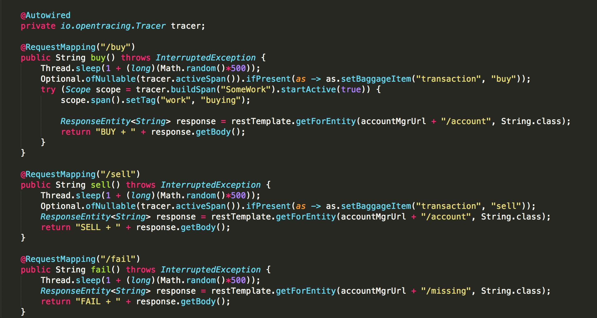
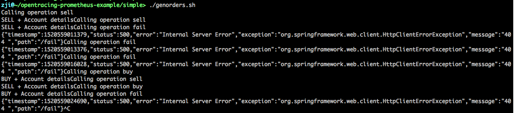
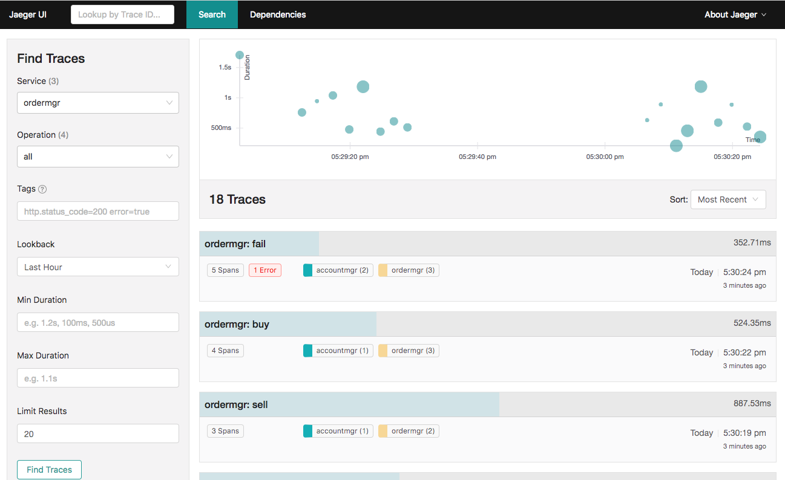
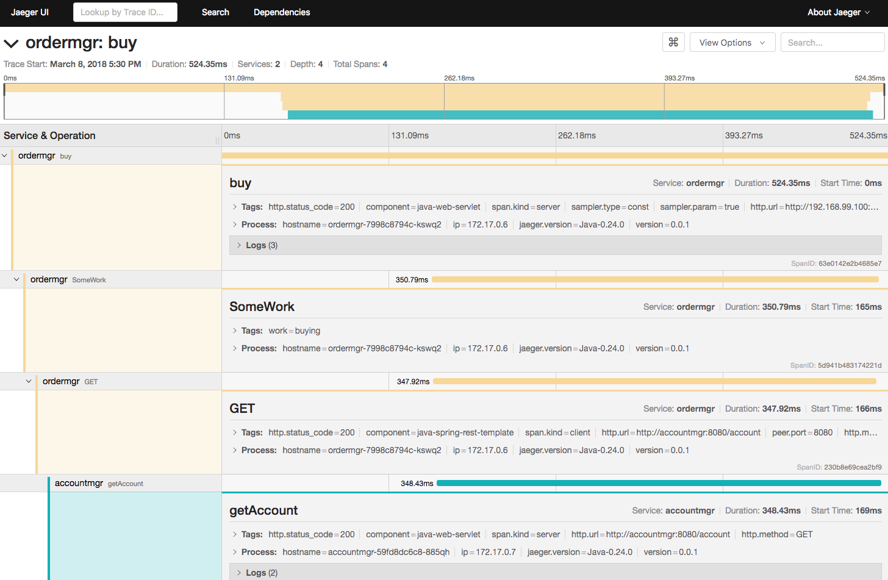

F5 CNCF Labs
==================

This introductory lab covers the following topics:


Lab 1: Install a Kubernetes Cluster (1 Master and 2 nodes)
===================================================
Lab 2: How to install and use F5 Container connector
====================================================
This lab covers the following topics:

- Install the F5 Kubernetes BIG-IP Controller
    - BIG-IP setup
    - Container Connector deployment
- Deploy an application and leverage our CC
    - Define a deployment
    - Define a ConfigMap
    - Define a Service

Lab 3.0: Setting up Heapster with influxdb and Grafana
======================================================

Git Clone https://github.com/kubernetes/heapster

Modify grafana.yaml
```
    # kubernetes.io/cluster-service: 'true'

```
    type: NodePort

Modify heapster.yaml
```
    #kubernetes.io/cluster-service: 'true'

Modify influxdb.yaml
```
    #kubernetes.io/cluster-service: 'true'

zji@~> kubectl create -f heapster/deploy/kube-config/influxdb/
deployment "monitoring-grafana" created
service "monitoring-grafana" created
serviceaccount "heapster" created
deployment "heapster" created
service "heapster" created
deployment "monitoring-influxdb" created
service "monitoring-influxdb” created

zji@~> kubectl create -f kubernetes-course/deployment/helloworld.yml
deployment "helloworld-deployment” created


Lab 3: Kubernetes cluster monitoring with Prometheus and Grafana
====================================================
If you are using minikube, please follow the following document:
docs/prometheus/prometheus-grafana-installation.rst

For my case, I use kubeadm to build my own Kubernetes Cluster (1 Master and 2 nodes). I encountered some issue with above steps.
Instead, I leveraged kube-prometheus to use a single command for installation.

```
    git clone https://github.com/coreos/prometheus-operator.git
```
Simply run:

```
export KUBECONFIG=<path> # defaults to "~/.kube/config"
cd contrib/kube-prometheus/
hack/cluster-monitoring/deploy
```
After all pods are ready, you can reach:

Prometheus UI on node port 30900
- Alertmanager UI on node port 30903
- Grafana on node port 30902
- To tear it all down again, run:

```
hack/cluster-monitoring/teardown
```
Lab 4: gRPC
====================================================
Lab 5: OpenTracing and Jaeger
====================================================
This repository contains an example of using OpenTracing and Prometheus to monitor an application in a Kubernetes environment.

First step is to install: 
1. OpenTracing compliant tracing system 
1. Prometheus in the cloud environment
1. Jaeger OpenTracing tracing system

* [Kubernetes instructions](opentracing-prometheus-example/Kubernetes.md)

The second step is to try out Simple Two Service Example. The example consists of two services, ordermgr and accountmgr. The first service presents two REST endpoints called buy and sell. These REST methods will call a hello REST endpoint on the second service.

Order Manager’s Controller:


```
The service injects the OpenTracing Tracer to enable access to the active span.

All three methods introduce a random delay.

The buy and sell methods additionally set a baggage item transaction with the name of the business transaction being performed (i.e. buy or sell). For those not familiar with OpenTracing, the baggage concept allows information to be carried in band with the trace context between invoked services. We will show you how a baggage item can be used to isolate the metrics relevant only for a particular business transaction.

Invoking a non-existent endpoint on accountmgr will lead to an error being reported in the trace and metric data.
```

To deploy the example on the appropriate cloud environment:

* [Kubernetes instructions](opentracing-prometheus-example/simple/Kubernetes.md)

Once the services have been successfully deployed and started it is time to try out the services. Using
the _ordermgr_ endpoint address (provided as part of the instructions for installing the example in
the cloud environment), perform some test calls to the service:

```
curl $ORDERMGR/buy
curl $ORDERMGR/sell
```

Then go to the OpenTracing dashboard to examine the traces that were generated from the service invocations. These
should show calls to _ordermgr_ and subsequently from _ordermgr_ to _accountmgr_.

Rather than manually invoke the endpoints above, the following script will loop randomly performing
these calls:

```
./genorders.sh
```






Lab 6: CoreDNS
====================================================
Lab 7: Fluentd and Distributed Logging
====================================================