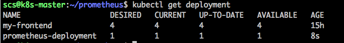
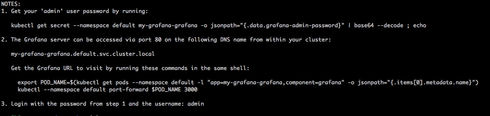

.. _my-cluster-setup:

Prometheus installation
====================

Overview
--------

Installing Prometheus
-------------

Lets start with deploy the configuration for Prometheus using a config map using :
::
    kubectl create -f prometheus-config-map.yaml

Next we deploy Prometheus itself using a Kubernetes yaml file. Create a file named prometheus-deployment.yaml and paste in the following content
::
	kubectl create -f prometheus-deployment.yaml

We can now check the deployment status using
::
    kubectl get deployment

When the deployment is complete and the Prometheus pod is running we can visit the Prometheus UI using port-forwarding. First get the pod name using kubectl get pods. Then using:
::
    kubectl port-forward prometheus_pod_name 9090:9090

we can visit http://127.0.0.1:9090 and we should see the Prometheus user interface. This should look like this

Installing Grafana
-------------
We are going to add Grafana to our cluster using Helm and Tiller. Helm and Helm charts are allow for predefined Kubernetes apps. You can find more on https://kubeapps.com/. 

install brew
::
    sudo apt install linuxbrew-wrapper

install Helm
Helm now has an installer script that will automatically grab the latest version
of the Helm client and [install it locally](https://raw.githubusercontent.com/kubernetes/helm/master/scripts/get).

You can fetch that script, and then execute it locally. It's well documented so
that you can read through it and understand what it is doing before you run it.

::
$ curl https://raw.githubusercontent.com/kubernetes/helm/master/scripts/get > get_helm.sh
$ chmod 700 get_helm.sh
$ ./get_helm.sh

Initialize helm using 
::
    helm init. 
Tiller (the Helm server-side component) has been installed into your Kubernetes Cluster.

When helm is initialized we can use 
::
    helm install --name my-grafana stable/grafana

I encountered the following error:
::
scs@k8s-master:~/prometheus$ helm install --name my-grafana --set rbac.create=true stable/grafana
Error: release my-grafana failed: namespaces "default" is forbidden: User "system:serviceaccount:kube-system:default" cannot get namespaces in the namespace "default"

The way to fix it:
1. eset the tiller
::
    helm reset --force
2. create these rbac config for tiller 
::
    kubectl create -f rbac-config.yaml
3. run helm init again
::
    helm init --service-account tiller

This will deploy Grafana to the Kubernetes cluster using Helm and Tiller. Again we can check the deployment of Grafana using 
::
    kubectl get deployment. 

If everything works as it should then you will get some instructions on how to get the admin password for Grafana. 

Setting up Grafana
-------------
The last part is to setup Grafana. The default install we used for installing Grafana using Helm does not include a public IP adress for Grafana. So we have to use a kubectl port forward to connect to Grafana.
::
    kubectl port-forward my-grafana-pod-name 3000:3000

By visiting http://127.0.0.1:3000 we can now configure Grafana. Log in to Grafana using admin and the password we retrieved earlier. Inside Grafana add a datasource using the Prometheus service URL.

After the datasource has been added it is finally time to add a dashboard. Goto import dashboards inside and import a dashboard using ID 1621. Grafana dashboards can be shared on Grafana dashboards. Using this dashboard ID in the import and choosing our Prometheus datasource we created earlier we should now see our first Grafana dashboard.

Happy dashboarding!
